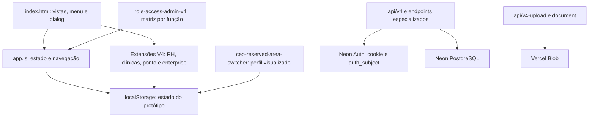

# Auditoria e correção do RH — Grupo Saúde V4

Data: 8 de outubro de 2026. Repositório: `miguelaalves84-dotcom/Grupo-Saude`.

Base analisada: `main`, commit `84fba5a2d6d7afcb0723ca312f4e617acc22823d`.
Branch local: `fix/v4-rh-session-initialization`.

## Estado da entrega e limites de validação

Correção implementada localmente; não publicada, não enviada para `main`, sem restauro de versões nem acesso a dados de produção. A clonagem Git falhou porque o proxy do executor não estava acessível. Os 48 ficheiros foram obtidos pela integração GitHub; criou-se um commit local de referência (`audit-snapshot`) e uma branch isolada. Esse commit é um snapshot, não uma cópia do histórico Git remoto. O histórico foi consultado através da API GitHub.

Passaram a análise de sintaxe dos 39 ficheiros JavaScript da aplicação e dos dois ficheiros de testes, e 20 testes com o código real executado num contexto JavaScript com DOM simulado. Isto **não equivale a aprovação funcional num navegador real**. O Chromium está instalado, mas a execução falhou com `setsockopt: Operation not permitted`; o servidor HTTP local também foi bloqueado. O pedido de execução fora do sandbox ficou pendente e foi interrompido, sem produzir resultados E2E. O teste Playwright está preparado em `tests/browser.py`, mas permanece por executar.

Não se validaram autenticação real, Neon, Blob, GPS, uploads reais, execução dos crons, uso simultâneo por vários utilizadores nem comportamento na aplicação publicada. O ambiente não disponibilizou credenciais dessas integrações. Não foi executado um build Vercel: o projeto não tinha script de build nem pipeline de compilação do frontend; trata-se de HTML e JavaScript diretamente carregados pelo navegador. A validação efetuada é de parsing e execução, não de deployment.

## Arquitetura observada

O frontend é uma aplicação de página única sem React, bundler ou router de framework. `index.html` contém as vistas, navegação, seletor de utilizadores e um único dialog partilhado. Carrega 33 scripts clássicos por ordem. Cada módulo é normalmente uma IIFE com a sua própria leitura/escrita de `localStorage`, listeners e, frequentemente, temporizadores ou observers. O estado principal está na chave `grupo_saude_v4_demo_2`.

São duas camadas de persistência distintas. A navegação/RH atualmente servida pelo HTML usa o estado local; os endpoints backend existentes não substituem automaticamente esse estado. A análise dos fluxos principais não encontrou um adapter geral ligando este frontend às sessões e recursos de `api/v4.js`. Uma sessão válida no backend e o `currentUser` local não são a mesma identidade.

| Área | Ficheiros e responsabilidades |
|---|---|
| Entrada e apresentação | `index.html`, `styles.css`, `app.js`: vistas, renderização base, operações, pedidos, chat, candidatos, tarefas, auditoria e ponto legado |
| Sessão, permissões e âmbito | `ceo-reserved-area-switcher-v4.js`, `role-access-admin-v4.js`, `access-scope-v4.js`, `access-log-v4.js`: identidade visualizada, matriz de ações, âmbito de dados e registo de acessos |
| RH e documentos | `clinic-hr-architecture.js`, `hr-master-v4.js`, `hr-form-fix-v4.js`, `contract-types-v4.js`: colaboradores/candidatos, ficha 360, formulários, contratos e checklists |
| Ponto, ausências e férias | `attendance-dashboard-v4.js`, `hr-separation-v4.js`, `hr-rosters-overtime-v4.js`, `hr-vacation-planning-v4.js`, `vacation-calendar-v4.js`, `clinic-calendars-v4.js`, `approvals-center-v4.js`: ponto pessoal/gestão, escalas, horas extra, calendários e aprovações |
| Clínicas e profissionais | `clinic-single-source-v4.js`, `clinic-master-v4.js`, `clinic-relations-v4.js`, `clinic-structure-renderer-v4.js`, `active-clinic-filter-v4.js`, `professional-selects.js`, `doctor-specialties.js`: mestre de clínicas, relações e seletores |
| Operação e integrações locais | `v4-master-integrations.js`, `scheduled-indicators.js`, `funnel-drag.js`: pedidos, indicadores e interação do funil |
| Funcionalidades transversais | `gs-enterprise.js`: financeiro, relatórios, marketing, alertas, segurança, migração de clínicas e backups; `global-search-v4.js`: pesquisa global |
| Correções e integridade | `validation-fixes.js`, `v4-data-integrity.js`, `safe-reset-v4.js`, `tables-canonical-controller-v4.js`: validações, integridade, reposição e controlador de tabelas |
| Testes existentes | `gs-test-agent-v4.js`: bateria embutida na interface, incluindo dados persistentes; não executada sobre dados reais nesta auditoria |
| Backend geral | `api/v4.js`: schema, autenticação, utilizadores, permissões, entidades e recursos operacionais/RH |
| Backend especializado | `api/v4-upload.js`, `api/v4-document.js`, `api/v4-clinic-gps.js`, `api/v4-retention.js`, `api/v4-cron-alerts.js`: documentos/Blob, GPS, retenção e alertas |
| Dados e deployment | `db/schema.sql`, `package.json`, `vercel.json`: schema, dependências Neon/Blob, headers e cron diário |
| Documentação | `PLANO-V4.md`, `README.txt`, `DEPLOY_PREVIEW.txt`, `docs/REGRAS-SELECAO-PROFISSIONAIS.md`; o README ainda refere V3.1 e Supabase, enquanto a API atual usa Neon |

O backend consulta Neon Auth através de `/get-session`, recebe o cookie da requisição e resolve o utilizador por `users.auth_subject`. Os endpoints consultam funções e associação a clínicas. As variáveis esperadas incluem `DATABASE_URL`, `DATABASE_NEON_AUTH_BASE_URL`, `BLOB_READ_WRITE_TOKEN` e `CRON_SECRET`. Os nomes foram inspecionados, não os valores. O schema SQL e o schema embutido na API coexistem e precisam de uma estratégia única de migração. O backend lista seis funções; o frontend também tem `BASICO`.

## Causas comprovadas e ficheiros/linhas

As linhas abaixo referem-se ao código base quando explicitamente indicado; os ficheiros minificados concentram funcionalidades inteiras numa linha.

1. **Erro de sintaxe no controlador RH:** `clinic-hr-architecture.js:59` (base e correção). Os handlers do calendário usavam duas barras antes de uma aspa dentro de uma string JavaScript. A string fechava na posição errada: `SyntaxError: Unexpected string`. O navegador rejeita o ficheiro inteiro, incluindo a definição de `V4ClinicHR`, que aparece antes do erro. Nenhuma tentativa posterior de abrir uma vista pode recuperar uma IIFE que nunca foi executada.
2. **Erro de sintaxe nas aprovações:** `approvals-center-v4.js:10`. O HTML de `ApprovalsV4.detail` contém o mesmo erro: `SyntaxError: missing ) after argument list`. O centro de aprovações não é registado. Corrigiram-se também handlers equivalentes nesses dois ficheiros; os handlers gerados pelo calendário e pela lista de aprovações foram compilados nos testes.
3. **Arranque parcial antes de `DOMContentLoaded`:** `app.js:66` e `app.js:192` na base; `access-scope-v4.js:2`. O App só carregava/migrava os dados ao receber `DOMContentLoaded`, mas uma extensão já escrevia `{clinics: [...]}` no armazenamento antes disso. `load()` interpretava esse objeto como estado existente, não aplicava o seed completo e `migrate()` falhava em `state.candidates.forEach`. O teste reproduz esta sequência, sem trocar de utilizador.
4. **Referências a variável removida:** `app.js:12`, `app.js:80`, `app.js:99` na base, e formulários que usam `options(clinics, ...)`. `clinics` foi renomeada para `demoClinics`, mas ficaram referências livres a `clinics`. O dashboard abortava o `renderAll()` com `ReferenceError: clinics is not defined`. Corrigiram-se as referências para a fonte mestre de clínicas e o fallback de demonstração apenas quando não existe essa fonte.
5. **Identidade não atualizada pelo RH:** `app.js:79` na base, agora `app.js:82`. `user()` procurava apenas na lista estática de utilizadores e devolvia o CEO quando não encontrava o ID. Agora lê primeiro a ficha persistida e devolve uma identidade sem privilégios para IDs desconhecidos.
6. **Navegação concorrente:** `app.js:190` e `clinic-hr-architecture.js:29` na base; `gs-enterprise.js:28` e `gs-enterprise.js:29`. O App apenas ativava algumas vistas; RH tinha um listener que forçava a vista num `setTimeout`, e os módulos enterprise tinham outro mecanismo. Um clique rápido RH → Dashboard podia ser revertido pelo callback RH. Agora existe um ponto de entrada comum, `App.showView`, renderização explícita e delegação de eventos para módulos adicionados depois do arranque. O callback atrasado do RH foi removido.
7. **Defaults de permissões impossíveis de aplicar:** `role-access-admin-v4.js:7` na base. `integrity()` criava todas as linhas com `false` antes do código que pretendia criar defaults. A condição que devia inicializar uma linha ausente nunca era verdadeira. Agora os defaults são aplicados somente a ações ausentes, antes da normalização. Valores explícitos `false` continuam preservados.
8. **Privilégios do CEO herdados nas aprovações:** `approvals-center-v4.js:2` e `clinic-hr-architecture.js:56`. A autorização usava `ceoRealUser`, sempre preenchido com `u1` pelo seletor, em vez do utilizador ativo. Agora usa `currentUser`. O teste comprova que Médico/a não aprova um pedido, mesmo com `ceoRealUser='u1'`, enquanto Administração pode fazê-lo.
9. **Normalização destrutiva de identidades no arranque:** `ceo-reserved-area-switcher-v4.js:5`. O seletor eliminava utilizadores/entradas de colaboradores quando nome/email coincidiam. Essa operação não migrava de forma completa documentos, férias e outras referências. Removeram-se essas eliminações automáticas. A deduplicação visual do seletor mantém-se; os registos persistidos são preservados.

**Sobre a intermitência descrita:** a versão atual de `main` contém erros determinísticos de parsing e de arranque. Foi possível reproduzi-los independentemente da troca de utilizador. Cache com versões diferentes dos scripts e diferenças no estado local são hipóteses compatíveis com o comportamento intermitente, mas não foram confirmadas na instância publicada. Não se atribui uma causa exclusiva à intermitência sem os logs/estado do navegador afetado. Foram atualizados os identificadores de versão dos scripts alterados para evitar misturar assets antigos numa futura publicação.

## Comparação histórica

| Commit | Evidência |
|---|---|
| `b2a333b5f4a8fed10f348f1717b80a6452695bf8` | Versão anterior de `clinic-hr-architecture.js` passa em `node --check`. É uma referência compilável, não uma garantia retrospectiva de funcionamento E2E |
| `fa28aa0be4c96f55d1d00e3418554424feb29923` | Introdução do calendário conjunto de férias/baixas; a versão desse ficheiro falha em parsing na linha 59. Regressão RH confirmada por comparação das duas versões |
| `5291b4397eab958975820c3381d76b1b82f0927b` | Renomeia `clinics` para `demoClinics` e adiciona âmbito operacional, deixando referências anteriores sem definição |
| `499565a79d21a6838230b49754010ff787d39da2` / `f5ba0b6caba21d00cf9fcba3f4694d07b01cb402` | Tentativa de atualização inicial dos módulos CEO e posterior retirada de rerenders; tratavam o sintoma de inicialização |
| `8a0026b0ae8f6852a4ec57dd75694197c4b904a8` | Exporta `showView` no objeto lexical App, mas sem resolver o parsing dos módulos RH nem a exposição consistente em `window` |
| `96c419aab0538effe3f5679deb79d47d8f42b3b1` / `ad7340ff7839e2f94378d1e9922ed026f4a642a3` | Mudanças na captura de navegação e retirada de render recursivo; não removem os bloqueios de parsing/arranque |
| `07904b23feffdf89a2c1755dd96377055ccdef37` | Mesmo tendo título de reparação de sintaxe das aprovações, o ficheiro consultado ainda falha em `node --check` na linha 10 |

Nenhum ficheiro foi restaurado de um commit anterior; corrigiu-se a versão mais recente preservando o calendário e as restantes funcionalidades.

## Duplicação e problemas estruturais restantes

Foram identificadas responsabilidades repetidas: renderização RH em `app.js` e `clinic-hr-architecture.js`; ponto em App, Attendance, HRSeparation e blocos de clinic-hr; calendários/propostas de férias em vários módulos; aprovações em App, clinic-hr, RoleAccess e Approvals; tabelas/estrutura de clínicas no HTML, enterprise e módulos de clínicas. A correção concentrou a navegação e mantém o RH legado apenas como fallback quando o controlador V4 não existe. Não se removeram componentes funcionais indiscriminadamente.

Ainda há polling (`setInterval`) para reenquadrar botões e atualizar aprovações, observers globais do documento e vários módulos a escrever o mesmo objeto local completo. Permanecem riscos de sobrescrita por callbacks assíncronos ou separadores concorrentes, e de divergência entre `users` e `employees`. Uma fonte de estado central com operações de atualização por entidade é recomendável, mas migrar toda a arquitetura nesta correção aumentaria o risco e não foi feito.

`AccessScopeV4` dá âmbito global apenas ao CEO, enquanto outros módulos tratam Administração como gestão; algumas verificações são por função e outras por matriz. O seletor é uma ferramenta de simulação do CEO, não autenticação. O frontend usa funções em maiúsculas e o backend usa nomes com outra capitalização. A matriz do backend/local não está sincronizada automaticamente. Estes pontos precisam de decisão e testes de integração antes de transformar o protótipo em aplicação multiutilizador real.

Há também dívida documental e operacional: README antigo, schemas duplicados, scripts concentrados em linhas enormes, criação de dados de teste no arranque e bateria embutida com escrita persistente. A ausência inicial de um comando de parsing permitiu publicar scripts sintaticamente inválidos. Acrescentaram-se `npm run check` e `npm test` para detetar esse problema antes de promover alterações.

## Alterações e preservação de dados

- `app.js`: inicialização síncrona antes das extensões; preenchimento de estruturas ausentes; inclusão do CEO na lista persistida; utilizadores e clínicas vindos do estado; API `window.App`; sincronização de perfil; navegação e renderização explícitas.
- `clinic-hr-architecture.js`: reparação das strings sem retirar calendário; API `render`; retirada da navegação atrasada e da remoção do primeiro botão de aprovações; atualização RH por mudança de perfil; autorização do calendário pelo perfil ativo.
- `approvals-center-v4.js`: reparação de strings; autorização pelo perfil ativo.
- `gs-enterprise.js`: navegação através do App e exposição de `render` para os módulos dinâmicos.
- `role-access-admin-v4.js`: defaults apenas para ações ausentes; guard sem navegação recursiva nem escrita durante cada consulta; sincronização no arranque; preservação de configurações guardadas; evita criar um segundo botão de pedidos de férias quando o original existe.
- `ceo-reserved-area-switcher-v4.js`: preservação das identidades persistidas e normalização do contexto de visualização.
- `index.html`: versões dos scripts alterados.
- `package.json` e `tests/`: comandos de validação, harness de regressão e E2E preparado.

Não se alteraram o schema, endpoints, documentos reais ou dados do navegador do utilizador. Os testes trabalharam com fixtures locais em memória. Preservam-se restrições explícitas na matriz: se uma Administração existente já tem `hrManage=false`, o módulo continuará negado até o CEO alterar essa permissão. Não há evidência suficiente para distinguir uma restrição intencional de um `false` gerado pelo bug antigo; conceder acessos indiscriminadamente não seria uma correção segura.

## Resultados dos testes

Comando executado: `GS_BASELINE_DIR=/tmp/gs-baseline npm test`.

Resultado: **41 ficheiros JavaScript analisados; 20 testes passaram**.

O baseline contém os quatro ficheiros originais extraídos de `audit-snapshot`. Num checkout Git completo pode ser preparado a partir do commit remoto `84fba5a2d6d7afcb0723ca312f4e617acc22823d`. Sem `GS_BASELINE_DIR`, `npm test` executa os 17 testes da correção e indica explicitamente que omitiu os três testes de reprodução histórica.

| Verificação | Resultado e alcance |
|---|---|
| Parsing do código | Passou; todos os 39 scripts da aplicação e dois scripts de testes |
| Reprodução dos erros anteriores | Passou: dois scripts inválidos, estado parcial pré-DOM e referência `clinics` indefinida |
| CEO e Administração → RH direto | Passou no DOM simulado, com matriz nova válida |
| Seis perfis pedidos | CEO, Administração, Administrativa, Call Center, Médico/a e Técnico/a: abertura/recusa de módulos conforme matriz no DOM simulado |
| Perfil adicional | Básico também testado |
| Troca de perfil e regresso imediato ao CEO | Passou sem necessidade de recarregar a sessão no teste do seletor nativo |
| RH → outro módulo antes dos timers | Passou; nenhum callback tardio volta a ativar RH |
| Aprovações ao visualizar outro perfil | Passou: Médico/a recusado, Administração autorizado |
| Identidade desconhecida | Passou: sem elevação para CEO |
| Registos duplicados | Passou: dados preservados pelo seletor |
| Ficha editada e clínicas mestre | Passou: renderer usa os valores persistidos e respeita mestre vazio |
| Dados preservados | Passou para fixtures de documentos, férias, campo extra e restrição explícita |
| Handlers inline do calendário e aprovações | Passou: código gerado compilável |
| Módulos adicionados posteriormente | Passou a delegação de navegação no DOM simulado |
| Chromium/E2E | **Pendente — bloqueado pelo sandbox**, não aprovado |
| Backend, sessões reais e dados reais | **Não executado**, apenas análise estática |

Para executar E2E num ambiente autorizado: `npm run test:browser`. Requer Python, Playwright e Chromium. Por defeito testa o HTML local; `GS_TEST_URL` permite apontar para um servidor local autorizado, e `GS_CHROMIUM` permite escolher o executável. O teste carrega todos os scripts, recolhe erros, percorre módulos permitidos e testa as áreas Colaboradores/Candidatos. **Ainda não há resultado desse teste.**

## Condições para publicação

Executar Chromium/E2E com todos os scripts; confirmar a matriz guardada dos utilizadores afetados; verificar navegação e ficha/ausências/documentos na instância de testes; verificar o diff contra o commit remoto usado como base. Só depois criar a entrega remota e promover com aprovação. O patch local não deve ser tratado como uma validação completa de produção.
