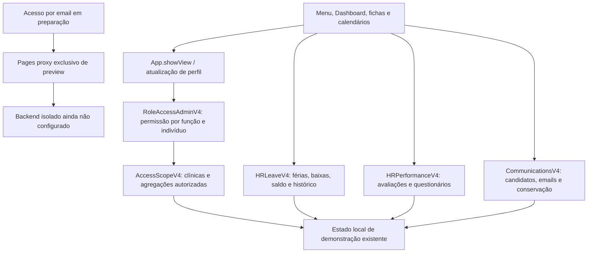

# Grupo Saúde V4 — relatório de consolidação

## Base identificada antes de alterar código

A versão mais recente com check **Cloudflare Pages / success** era o commit `b9a50bd14bc0a2706bec63031e31f4615db41f1a`, branch `feat/v4-rh-performance-issue-8`, PR #9, publicado em 2026-10-08 às 23:56:45 UTC: https://c4bd24c1.grupo-saude.pages.dev . Os heads das branches e respetivos checks foram comparados. A branch main estava em `84fba5a2d6d7afcb0723ca312f4e617acc22823d`, anterior às correções, e não foi usada como base.

Branch de trabalho: `feat/v4-consolidation-dashboard-access`. A publicação usa o commit remoto acima como pai, preservando os PRs #5, #7 e #9. Nenhum merge para main, promoção para produção, consulta ao backend de produção, alteração de credenciais ou migração de base de dados foi executado.

## Arquitetura e origens dos problemas

O projeto usa HTML/CSS e scripts JavaScript clássicos, sem build de frontend nem framework. `App` inicia o estado; extensões usam a mesma chave `grupo_saude_v4_demo_2`. RH, ponto, documentos, financeiro e recrutamento mantêm referências entre arrays/mapas nesse estado. Há um backend Node/Vercel com Neon e Blob e schema SQL, mas o protótipo Cloudflare não o utiliza para autenticar ou persistir os fluxos de demonstração. Foi acrescentado apenas um proxy Pages independente, bloqueado por defeito.

As falhas originais de RH e aprovações incluíam erros de sintaxe, inicialização parcial antes do DOM e permissões calculadas usando o CEO original em vez do perfil ativo. Esses defeitos já estavam corrigidos no PR #5; os testes históricos continuam a reproduzi-los a partir de `84fba5a`. Não se restaurou essa versão.

| Origem encontrada | Consequência | Correção |
| --- | --- | --- |
| `ceo-reserved-area-switcher-v4.js`, `sw` | Mudança de perfil dependia de reload. | Atualizar estado, aplicar permissões, emitir evento e abrir imediatamente módulo permitido. |
| `hr-form-fix-v4.js`, antiga sincronização periódica | Substituía lista users, perdendo utilizadores sem ficha, campos e estado. | Sincronização incremental por ID, sem eliminação e sem polling. |
| `tables-canonical-controller-v4.js`, handler capture | Ativava secções manualmente, contornando navegação/permissões. | Delegar em App.showView e autorizar o installer. |
| `global-search-v4.js`, observer do body | Observar e modificar os próprios resultados provocava trabalho repetido. | Atualização por eventos e input. |
| `active-clinic-filter-v4.js`, correspondência por texto | Escondia cartões/linhas históricas contendo nomes de clínicas. | Apenas selects operacionais explicitamente identificados. |
| `clinic-single-source-v4.js`, clean/syncAll | Eliminava referências sem registo mestre e reescrevia estado por colaborador. | Conservar referências arquivadas; sincronizar em lote. |
| `gs-enterprise.js`, migração c1/c2/c3 | Remapeava parte das referências automaticamente, deixando outras inconsistentes. | Retirar execução automática do mapa não verificado. Não desfazer remapeamentos históricos sem revisão. |
| `RoleAccessAdminV4`, permissões | Dashboard usava área pessoal; exceções individuais eram ignoradas em controladores. | Regra fixa CEO/Administração, permission partilhada e editor individual auditado. |
| `App.renderAll`, chat | Renderizava módulos privados invisíveis e mantinha conversa de outro perfil. | Limpar módulos não autorizados e revalidar membros das conversas. |
| `V4ClinicHR.promoteCandidate` | Eliminava candidato e podia sobrepor uma ficha. | Conversão única por vínculo, candidatura/histórico/documentos conservados e bloqueio de email já existente. |
| `HRMasterV4`, checklists | Mudança de contrato podia retirar documentos previamente associados. | Conservar documentos e marcar requisitos históricos. |
| `App.confirmClock`, callbacks GPS/ficheiros | Callback tardio podia guardar no perfil seguinte; fallback de horas atribuía a const. | Capturar ator, revalidar sessão/baixa e corrigir variáveis de hora. |

Ainda existem auxiliares read/write e extensões históricas no projeto. Foram mantidos os que têm dependências operacionais; não se afirma que toda a base está livre de duplicação. As funções de férias, calendário, avaliação e permissões reutilizam os controladores canónicos em vez de acrescentar renderizações concorrentes.

## Funcionalidades desta branch

- Dashboard apenas CEO/Administração, inclusive na visualização CEO de outro colaborador. Dados e navegação verificam a mesma autorização. Administração vê só clínicas atribuídas e ativas; seleção individual ou todas as autorizadas; filtro de período e pesquisa de clínica.
- Cartões de consultas/tratamentos previstos e realizados, pedidos, tarefas, abertura/fecho, estado operacional, indicadores registados, comparação por clínica e gráfico diário com seleção de série.
- Menu agrupado, grupos expansíveis, recolhimento e adaptação móvel. Atalhos reutilizam módulos existentes. Financeiro oferece filtros Contas correntes, Faturas/recibos, Pagamentos e Bónus no mesmo módulo, com autorização de gestão separada da consulta própria.
- Componentes/estilos partilhados, superfícies, espaçamento, tipografia, modo claro/escuro persistido fora dos dados, foco visível, skip link e respeito por redução de movimento. Funil de pedidos existente preservado.
- Entrada RH com áreas Colaboradores/Candidatos distintas; lista por identidade com utilizadores legados, contagem correta de ativos, fichas mestre/tabs, documentos, férias, aprovações, desempenho e histórico existentes.
- Ficha de candidato, CV, contacto por mailto, marcação de entrevista, resultado e decisão com motivo, conversão conservando ficha/documentos/histórico. Checklist e ficha completa antigas continuam acessíveis.
- Importação manual de CV com validação e idempotência para testar o domínio; importação automática por OAuth depende do backend pendente.
- Lista de Emails com cinco ações iniciais, campos editáveis, validações, estados e registo de execução/erro. Execução externa passa pelo proxy e falha claramente quando não configurado.
- Plano de conservação documental para inativos, sem eliminação/envio automático. Alterações de email na ficha ficam assinaladas como pendentes de verificação no serviço real.
- Permissões individuais permitem herdar, permitir ou bloquear; staff não pode receber Dashboard. Alternância e regresso CEO sem reload; modais/conversas anteriores são limpos.
- Ponto verifica baixa aprovada também nos métodos diretos e callbacks. Calendários e históricos de férias/baixas permanecem acessíveis. Preservadas regras de reagendamento parcial, restituição apenas de dias sobrepostos, aprovações auditadas, avaliações versionadas e limiar de anonimato dos questionários.

## Testes e limites da validação

`npm test`: **109 testes aprovados** — 101 de regressão/consolidação com JavaScript real em DOM simulado e 8 do proxy com backend simulado. `GS_BASELINE_DIR=/tmp/gs-baseline npm test`: **112 aprovados**, incluindo três reproduções históricas. Sintaxe de **52 ficheiros JavaScript** validada, incluindo Pages Function ES module. HTML analisado e git diff --check sem erros. Não há bundler; não foram introduzidas dependências.

Cobertura: seis perfis + Básico legado; navegação direta; exceções individuais; Dashboard/clínicas/períodos/inativos; CEO sem reload; sincronização de identidades sem duplicação/eliminações; candidato/importação/conversão; configuração de emails; conservação; férias/baixas e reversões; ponto; avaliação/questionários; privacidade de chat/financeiro; limpeza de conteúdos; handlers HTML e agrupamento do menu. Teste de 1.000 colaboradores confirma no máximo duas escritas para sincronização de clínicas, em vez de uma por colaborador. Não é um benchmark de desempenho visual.

`npm run test:browser` foi tentado: Chromium termina antes de abrir a aplicação (`setsockopt: Operation not permitted`, SIGTRAP). **Testes manuais/reais em navegador, responsive/contraste e ponta a ponta com serviços externos não foram concluídos.** O script E2E continua disponível; não apresentar testes em DOM simulado como testes reais dos seis perfis.

## Limitações que precisam de revisão

1. Autenticação/email reais ainda não configurados: ver [configuração e contrato](CONFIGURACAO-TESTE-AUTH-EMAIL.md). Tokens únicos, OAuth, jobs, verificação de email e sessões sobre dados do servidor dependem dessa implementação, não apenas de preencher variáveis.
2. localStorage é inspecionável e alterável. As permissões melhoram o protótipo e impedem acessos pelos fluxos suportados, mas não constituem isolamento de segurança de produção. Autorizar todos os dados no servidor é obrigatório antes de uso real.
3. Registos históricos já parcialmente remapeados pelo mapa c1/c2/c3 precisam de confirmação das clínicas reais. Foram preservados, sem adivinhar associações nem restauros. Identidades já duplicadas também exigem revisão antes de fusão.
4. Cada URL/origem de preview tem o seu próprio localStorage. Os dados no preview anterior não foram apagados nem copiados automaticamente para o novo. Para testar com esses dados, transportar uma cópia de teste explicitamente; não usar dados pessoais reais nem um restauro de produção.
5. A legislação e políticas de retenção/contrato precisam de validação operacional. Não houve criação de regra financeira automática, envio de documentos ou exclusão de históricos.

## Roteiro manual de aceitação no preview

CEO: abrir RH diretamente; Colaboradores → ficha → férias/calendário → aprovações; abrir Candidatos, importar o mesmo sourceId duas vezes, entrevistar/aprovar/converter e confirmar histórico. Administração: repetir com clínicas atribuídas, bloquear uma permissão individual e verificar acesso direto. Restantes perfis: Dashboard indisponível mesmo via App.showView, conta e RH próprios; CEO selecionar cada um e regressar imediatamente. Verificar baixa sobre férias, saldo exato e bloqueio do ponto. Testar tema, grupos, móvel e filtros financeiros. Emails/acesso por email devem indicar serviço pendente; não declarar email enviado com resposta 503.

## Ficheiros alterados

- `access-scope-v4.js`
- `account.html`
- `account.js`
- `active-clinic-filter-v4.js`
- `app.js`
- `ceo-reserved-area-switcher-v4.js`
- `clinic-hr-architecture.js`
- `clinic-single-source-v4.js`
- `communications-v4.js`
- `docs/CONFIGURACAO-TESTE-AUTH-EMAIL.md`
- `docs/CONSOLIDACAO-V4-RELATORIO.md`
- `functions/api/preview.js`
- `global-search-v4.js`
- `gs-enterprise.js`
- `hr-form-fix-v4.js`
- `hr-leave-domain-v4.js`
- `hr-master-v4.js`
- `hr-performance-ui-v4.js`
- `hr-separation-v4.js`
- `index.html`
- `package.json`
- `role-access-admin-v4.js`
- `styles.css`
- `tables-canonical-controller-v4.js`
- `tests/browser.py`
- `tests/consolidation.cjs`
- `tests/preview-proxy.cjs`
- `tests/runtime.cjs`
- `tests/syntax.cjs`
- `workspace-shell-v4.js`
